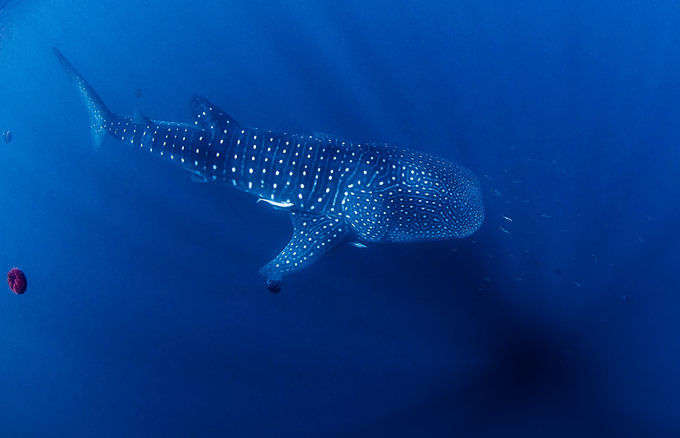

// add cover image to img directory and update filename below
ifdef::backend-html5[]

endif::backend-html5[]

== Colophon

=== Suggested citation

GBIF Secretariat & IAIA (2020) Best Practices for Publishing Biodiversity Data from Environmental Impact Assessments. Copenhagen: GBIF Secretariat. https://doi.org/10.35035/doc-5xdm-8762

=== Contributors

Andrew Rodrigues, Dag Endresen, Rui Figueira, Cristina Villaverde, Miguel Vega, Nick King, Asha Raivanshi and Jo Treweek contributed to this document.

=== Licence

The document _Best Practices for Publishing Biodiversity Data from Environmental Impact Assessments_ is licensed under https://creativecommons.org/licenses/by-sa/4.0[Creative Commons Attribution-ShareAlike 4.0 Unported License].

=== Persistent URI

https://doi.org/10.35035/doc-5xdm-8762

=== Document control

Second edition, November 2020

// include reference to provenance if possible/relevant
https://doi.org/10.15468/doc-yyyy-yyyy[Second edition], March 2015, by Due Autore and https://orcid.org/0000-0000-0000-0000[Troisième Auteur].

Originally based on an earlier publication, _Towards establishing the special guide to something_.

=== Cover image

// Caption. Credit, source, licence.
Western honey bee (_Apis mellifera_), Hardy County, Florida, United States. Photo 2018 thebugroomno2 via https://www.gbif.org/occurrence/1945467387[iNaturalist research-grade observations], licensed under http://creativecommons.org/licenses/by-nc/4.0/[CC BY-NC 4.0].
